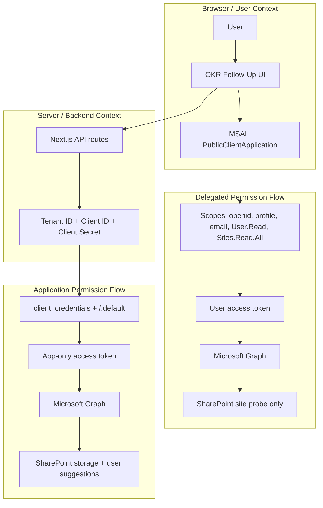

# OKR Follow-Up Auth Flow

This app uses a hybrid permission model:

- `Delegated` permissions in the browser for sign-in and the SharePoint site connectivity probe
- `Application` permissions on the server for Graph-backed SharePoint storage and tenant user suggestions

## Mermaid Diagram

## Short Explanation

### Delegated

The signed-in user authenticates in the browser through MSAL. The app acquires a user token with delegated scopes and uses it to verify SharePoint site access.

### Application

The Next.js server uses the app registration's tenant ID, client ID, and client secret to request an app-only Microsoft Graph token via `client_credentials`. That token is used for backend SharePoint reads/writes and tenant user suggestions.
